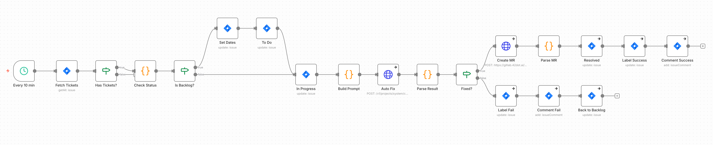

# auto-fix-scheduler

JIRA 티켓의 `ai:auto-fix` 라벨을 감지하여 자동으로 코드 수정을 수행하는 스케줄 기반 워크플로우.

---

## 개요

| 항목 | 값 |
|------|-----|
| **트리거** | Schedule (10분 간격) |
| **주요 기능** | JIRA 티켓 자동 수정, MR 생성, 리뷰어 할당, 상태 전이 |

---

## n8n Workflow



---

## JIRA 상태 전이

### 성공 케이스

```
Backlog ──► To Do ──► In Progress ──► Resolved
   │                                      │
   └── ai:auto-fix ──────────────► ai:auto-fixed
```

### 실패 케이스

```
Backlog ──► To Do ──► In Progress ──► Backlog
   │                                      │
   └── ai:auto-fix ──────────► ai:auto-fix-failed
```

---

## 노드 상세

### 1. Fetch Tickets

JIRA API로 `ai:auto-fix` 라벨이 있는 티켓 조회:

```
JQL: project = __JIRA_PROJECT__ AND labels = "ai:auto-fix" AND status = BACKLOG ORDER BY created ASC
LIMIT: 5
```

**사용 노드**: `n8n-nodes-base.jira` (Native JIRA Node)

### 2. Check Status

상태 확인 및 날짜 계산:

```javascript
const issue = $input.item.json;
const status = issue.fields?.status?.name || '';
const needsToDoTransition = status === 'Backlog';
const today = new Date().toISOString().split('T')[0];
const nextWeek = new Date(Date.now() + 7 * 24 * 60 * 60 * 1000).toISOString().split('T')[0];

return {
  json: {
    ...issue,
    needsToDoTransition,
    startDate: today,
    dueDate: nextWeek
  }
};
```

### 3. Set Dates (Backlog인 경우)

JIRA 티켓에 시작일/마감일 설정:

**사용 노드**: `n8n-nodes-base.jira` (Native JIRA Node)

```json
{
  "operation": "update",
  "issueKey": "{{ $json.key }}",
  "updateFields": {
    "customfield_10015": "{{ $json.startDate }}",
    "duedate": "{{ $json.dueDate }}"
  }
}
```

### 4. Status Transitions

JIRA 상태 전이 (Native JIRA Node 사용):

| 노드 | Status ID | 설명 |
|------|-----------|------|
| To Do | 51 | Backlog → To Do |
| In Progress | 21 | To Do → In Progress |
| Resolved | 31 | In Progress → Resolved (성공 시) |
| Back to Backlog | 61 | In Progress → Backlog (실패 시) |

### 5. Build Prompt

Auto Fixer 에이전트용 프롬프트 구성:

```javascript
const issue = $('Check Status').item.json;
const prompt = `Auto-fix JIRA ticket

**JIRA Key**: ${issue.key}
**Summary**: ${issue.fields?.summary || 'N/A'}`;

return {
  json: {
    jira_key: issue.key,
    jira_summary: issue.fields?.summary,
    prompt
  }
};
```

### 6. Auto Fix

Claude Code 실행:

```
POST {N8N_API_URL}/v1/projects/system/chat
```

```json
{
  "user_message": "<Build Prompt 결과>",
  "agent": "Auto Fixer",
  "source": "scheduler",
  "requester": "auto-fix-scheduler",
  "metadata": {
    "jira_key": "<jira_key>",
    "workflow_execution_id": "<n8n execution id>"
  }
}
```

**Timeout**: 600초 (10분)

### 7. Parse Result

Structured Output 파싱 및 리뷰어 설정:

```javascript
const prev = $('Build Prompt').item.json;
const r = $input.item.json;
let res = {
  fixed: false,
  branch_name: '',
  commit_sha: '',
  files_changed: [],
  summary: '',
  error: ''
};

if (r.status !== 'completed') {
  res.error = r.error?.message || 'API error';
} else if (r.structured_output) {
  res = { ...res, ...r.structured_output };
} else {
  res.error = 'No structured output';
}

// .n8n-config.json의 autoFixReviewers에서 주입됨 (콤마 구분 문자열 → 배열 변환)
const reviewers = '__AUTO_FIX_REVIEWERS__'.split(',').filter(Boolean);

return { json: { ...prev, ...res, execution_id: r.id, reviewers } };
```

### 8. Create MR

GitLab MR 생성 (리뷰어 username으로 직접 할당):

```
POST https://__GITLAB_HOST__/api/v4/projects/__GITLAB_PROJECT__/merge_requests
```

```json
{
  "source_branch": "{{ branch_name }}",
  "target_branch": "__TARGET_BRANCH__",
  "title": "[{{ jira_key }}] {{ jira_summary }}",
  "description": "## Auto-fix\n\n{{ summary }}\n\n**Files changed:**\n{{ files_changed }}\n\n---\n🤖 Generated by Auto Fixer",
  "remove_source_branch": true,
  "reviewers": ["username1", "username2"]
}
```

### 9. Parse MR

MR 응답 파싱:

```javascript
const prev = $('Fixed?').item.json;
const mr = $input.item.json;
const mr_url = mr.web_url || null;
const mr_iid = mr.iid || null;
return { json: { ...prev, mr_url, mr_iid } };
```

### 10. Label Update

**성공 시** (Native JIRA Node):
```json
{
  "operation": "update",
  "issueKey": "{{ jira_key }}",
  "updateFields": {
    "labels": ["ai:auto-fixed"]
  }
}
```

**실패 시** (Native JIRA Node):
```json
{
  "operation": "update",
  "issueKey": "{{ jira_key }}",
  "updateFields": {
    "labels": ["ai:auto-fix-failed"]
  }
}
```

### 11. JIRA Comment

**성공 시** (Native JIRA Node):
```
🤖 *Auto-fix completed*

• Branch: {{ branch_name }}
• MR: {{ mr_url }}
• Commit: {{ commit_sha }}

{{ summary }}
```

**실패 시** (Native JIRA Node):
```
🤖 *Auto-fix failed*

{{ error || summary || 'Unknown error' }}
```

---

## Auto Fixer Agent

### Structured Output Schema

```json
{
  "type": "object",
  "properties": {
    "fixed": {
      "type": "boolean",
      "description": "수정 성공 여부"
    },
    "branch_name": {
      "type": "string",
      "description": "생성된 브랜치 이름"
    },
    "commit_sha": {
      "type": "string",
      "description": "커밋 SHA"
    },
    "files_changed": {
      "type": "array",
      "items": { "type": "string" },
      "description": "변경된 파일 목록"
    },
    "summary": {
      "type": "string",
      "description": "수정 내용 요약"
    }
  },
  "required": ["fixed"]
}
```

---

## JIRA 라벨

| 라벨 | 의미 |
|------|------|
| `ai:auto-fix` | 자동 수정 대상 (입력) |
| `ai:auto-fixed` | 자동 수정 완료 |
| `ai:auto-fix-failed` | 자동 수정 실패 |

---

## 설정

### Placeholder

| Placeholder | 설명 | Config Key |
|-------------|------|------------|
| `__JIRA_PROJECT__` | JIRA 프로젝트 키 | `jira.project` |
| `__GITLAB_HOST__` | GitLab 호스트 | `gitlab.host` |
| `__GITLAB_PROJECT__` | GitLab 프로젝트 경로 (URL 인코딩) | `gitlab.project` |
| `__AUTO_FIX_REVIEWERS__` | MR 리뷰어 username (콤마 구분) | `autoFixReviewers` |
| `__JIRA_CREDENTIAL_ID__` | JIRA API 인증 ID | `credentials.jiraSoftwareCloudApi.id` |
| `__GITLAB_CREDENTIAL_ID__` | GitLab API 인증 ID | `credentials.httpHeaderAuth.id` |

### n8n 환경변수

| 변수 | 설명 |
|------|------|
| `N8N_API_URL` | claudio-api URL |

### Credentials

| Credential | 용도 |
|------------|------|
| `jiraSoftwareCloudApi` | JIRA API 인증 |
| `httpHeaderAuth` | GitLab API 인증 |

---

## 리뷰어 할당

`.n8n-config.json`의 `autoFixReviewers`에서 콤마로 구분된 리뷰어 목록을 설정합니다.

```json
{
  "autoFixReviewers": "username1,username2,username3"
}
```

`n8n-workflows.sh push` 실행 시 `__AUTO_FIX_REVIEWERS__` 플레이스홀더가 해당 문자열로 치환되고, `Parse Result` 노드에서 `.split(',').filter(Boolean)`으로 배열로 변환됩니다.

GitLab API의 `reviewers` 파라미터에 username 배열을 전달하면 자동으로 해당 사용자가 리뷰어로 할당됩니다.

---

## 에러 처리

### API 타임아웃

```javascript
if (r.status === 'timeout') {
  // 라벨: ai:auto-fix-failed
  // JIRA 코멘트: 타임아웃 알림
  // 상태: Backlog로 복귀
}
```

### Structured Output 없음

```javascript
if (!r.structured_output) {
  // 에러 처리: "No structured output"
  // 실패 플로우로 분기
}
```

### MR 생성 실패

모든 JIRA/GitLab API 호출에 `onError: continueRegularOutput` 설정으로 워크플로우 중단 방지.

---

## 연관 워크플로우

- [slack-message-handler](slack-message-handler.md) — `can_auto_fix` 플래그로 자동 수정 가능 여부 표시
- [slack-reaction-handler](slack-reaction-handler.md) — `:two:` 리액션으로 `ai:auto-fix` 라벨 추가
