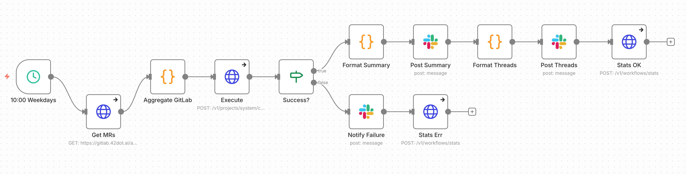

# daily-report

매일 10:00 (월~금) 데일리 스크럼 리포트를 자동 생성하는 워크플로우.

---

## 개요

| 항목 | 값 |
|------|-----|
| **트리거** | Schedule Cron `0 10 * * 1-5` |
| **Agent** | Daily Reporter |
| **출력** | Summary 메시지 + 담당자별 스레드 답글 |

---

## n8n Workflow



---

## 노드 상세

### 1. 10:00 Weekdays

스케줄 트리거: 월~금 10:00 KST 실행.

```json
{
  "rule": {
    "interval": [{ "field": "cronExpression", "expression": "0 10 * * 1-5" }]
  }
}
```

### 2. Get MRs

GitLab API에서 어제~오늘 MR 수집.

```
GET /projects/{id}/merge_requests?updated_after=yesterday&state=all
```

- 월요일: 금~일 3일간 데이터
- 화~금: 전일 데이터

### 3. Aggregate GitLab

MR 데이터를 담당자별로 집계.

```javascript
{
  mrs_merged: [{ iid: 89, title: "...", author: "..." }],
  mrs_opened: [{ iid: 94, title: "...", author: "..." }],
  merged_by_author: { "user1": 5, "user2": 3 },
  opened_by_author: { "user1": 2 },
  total_merged: 8,
  total_opened: 2
}
```

### 4. Execute

claudio `/chat` 호출.

```
POST /v1/projects/system/chat
```

**Body**:
```json
{
  "user_message": "Generate daily scrum report. Date: 2025-12-12 (Thu)",
  "agent": "Daily Reporter",
  "source": "n8n-scheduler",
  "requester": "daily-report-workflow",
  "metadata": {
    "gitlab_data": { ... },
    "workflow_execution_id": "..."
  }
}
```

**Timeout**: 660000ms (11분)

### 5. Success?

`status === 'completed'` 확인.

### 6. Format Summary

structured_output(JSON string)을 파싱하여 Slack 메시지 형식으로 변환.

```javascript
let output = result.structured_output || {};
if (typeof output === 'string') {
  try { output = JSON.parse(output); } catch(e) { output = {}; }
}
```

### 7. Post Summary

메인 채널에 Summary 메시지 발송. `ts` 값 저장.

### 8. Format Threads

`thread_messages` 배열을 개별 스레드 메시지로 변환.

### 9. Post Threads

Summary의 `thread_ts`를 사용하여 담당자별 스레드 답글 발송.

```json
{
  "thread_ts": {
    "replyValues": {
      "thread_ts": "{{ $json.thread_ts }}"
    }
  }
}
```

### 10. Stats OK / Stats Err

워크플로우 실행 통계 기록.

---

## Structured Output

Agent가 반환하는 JSON 스키마:

```json
{
  "summary_message": ":bar_chart: *TMS 데일리 브리핑* | 2025-12-12 (목)\n\n*오늘의 핵심*\n• ...",
  "thread_messages": [
    {
      "assignee": "홍길동",
      "slack_id": "U06G3GYL05P",
      "message": "<@U06G3GYL05P> | 진행중 3건\n\n*오늘 집중*\n• ..."
    }
  ]
}
```

---

## 설정

### Placeholders

| Placeholder | 설명 |
|-------------|------|
| `__GITLAB_HOST__` | GitLab 호스트 |
| `__GITLAB_PROJECT__` | GitLab 프로젝트 경로 |
| `__GITLAB_CREDENTIAL_ID/NAME__` | GitLab 인증 |
| `__DAILY_REPORT_CHANNEL__` | 발송 채널 ID |
| `__SLACK_CREDENTIAL_ID/NAME__` | Slack 인증 |

### 배포

```bash
./scripts/n8n-workflows.sh push daily-report
```

---

## 에러 처리

### Timeout

- Execute 노드 타임아웃: 660초
- 타임아웃 시 Slack에 `:hourglass: Timeout` 메시지 발송

### API 오류

- Execute 실패 시 에러 메시지 발송
- 통계에 `status: error` 기록

---

## 연관 문서

- [slack-mention-handler.md](slack-mention-handler.md) — Slack 멘션 처리 패턴 참고
