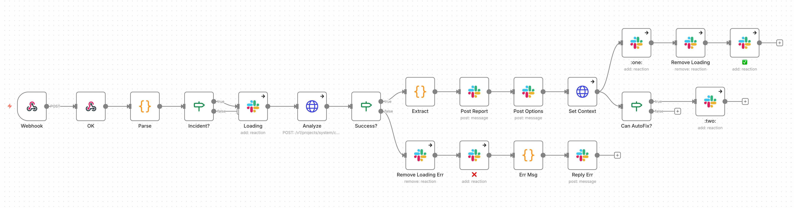

# slack-message-handler

특정 채널의 메시지를 감지하여 자동으로 장애 분석을 수행하는 워크플로우.

---

## 개요

| 항목 | 값 |
|------|-----|
| **트리거** | Webhook (`/webhook/slack-message`) |
| **소스 이벤트** | Slack `message.channels` |
| **주요 기능** | 장애 알림 감지, 자동 분석, JIRA 생성 옵션 |

---

## n8n Workflow



---

## can_auto_fix 로직

AI가 분석 결과에서 자동 수정 가능 여부를 판단합니다.

### Structured Output

Incident Analyzer 에이전트가 반환하는 `structured_output`:

```json
{
  "slack_report": "📊 *장애 분석 결과*\n...",
  "jira_title": "[BUG] payment-service - High Error Rate",
  "jira_description": { "type": "doc", "content": [...] },
  "priority": "High",
  "can_auto_fix": true
}
```

### 옵션 표시 조건

```javascript
const can_auto_fix = meta.can_auto_fix === true;

// Post Options 노드에서:
text: can_auto_fix
  ? `:jira-new: *${jira_title}*\n:one: JIRA 생성 | :two: JIRA + 자동수정`
  : `:jira-new: *${jira_title}*\n:one: JIRA 생성`
```

| can_auto_fix | 표시 옵션 |
|--------------|----------|
| `true` | `:one: JIRA 생성` + `:two: JIRA + 자동수정` |
| `false` | `:one: JIRA 생성` 만 표시 |

### 리액션 추가

```
Set Context → :one: (항상)
           → Can AutoFix? → :two: (can_auto_fix=true일 때만)
```

---

## 노드 상세

### 1. Parse

Datadog 알림 메시지 파싱:

```javascript
const INCIDENT_CHANNELS = '__INCIDENT_CHANNELS__'.split(',').filter(Boolean);
const e = $('Webhook').item.json.body;

// 채널 필터링
if (INCIDENT_CHANNELS.length > 0 && !INCIDENT_CHANNELS.includes(e.channel)) {
  return { json: { skip: true } };
}

// Datadog 알림 attachment 파싱
const att = (e.attachments || []).find(a => (a.title || '').startsWith('Triggered:'));
if (!att) return { json: { skip: true } };

// 알림 정보 추출
const alert = {
  severity: tm?.[1] || 'unknown',    // WARN, ERROR 등
  project: tm?.[2] || 'unknown',
  alert_name: tm?.[3] || 'unknown',
  env: tm?.[5] || 'unknown',
  service: sm?.[1] || '',
  trace_id: '...',
  log_timestamp: '...',
  log_message: '...',
  query: '...'
};

const prompt = `Analyze Incident Alert\n\n## Alert Info\n...`;
return { json: { skip: false, channel, ts, thread_ts, prompt, alert } };
```

### 2. Loading

분석 시작 표시 (Native Slack Node):

```json
{
  "resource": "reaction",
  "operation": "add",
  "channelId": "{{ $json.channel }}",
  "timestamp": "{{ $json.ts }}",
  "name": "loading"
}
```

**사용 노드**: `n8n-nodes-base.slack v2.2`

### 3. Analyze

Incident Analyzer 에이전트 실행:

```
POST {N8N_API_URL}/v1/projects/system/chat
```

```json
{
  "user_message": "<Parse에서 생성한 prompt>",
  "agent": "Incident Analyzer",
  "source": "slack",
  "requester": "slack-incident-workflow",
  "metadata": {
    "channel": "<channel>",
    "thread_ts": "<thread_ts>",
    "service": "<service>",
    "env": "<env>",
    "triggered_by": "datadog",
    "workflow_execution_id": "<n8n execution id>"
  }
}
```

**Timeout**: 660초 (11분)

### 4. Extract

분석 결과 추출:

```javascript
const r = $input.first().json;
const p = $('Parse').item.json;
const meta = r.structured_output || {};
const can_auto_fix = meta.can_auto_fix === true;

return {
  json: {
    channel: p.channel,
    ts: p.ts,
    thread_ts: p.thread_ts,
    execution_id: r.id,
    alert: p.alert,
    slack_report: meta.slack_report || ':warning: Analysis completed but no report generated',
    jira_title: meta.jira_title || `[BUG] ${p.alert.service} - ${p.alert.alert_name}`,
    can_auto_fix,
    context: JSON.stringify({ alert: p.alert, analysis: meta, can_auto_fix })
  }
};
```

### 5. Post Report (Native Slack Node)

분석 결과 스레드 응답:

```json
{
  "select": "channel",
  "channelId": "{{ $json.channel }}",
  "text": "{{ $json.slack_report }}",
  "otherOptions": {
    "thread_ts": "{{ $json.thread_ts }}"
  }
}
```

**사용 노드**: `n8n-nodes-base.slack v2.2`

### 6. Post Options (Native Slack Node)

JIRA 생성 옵션 표시:

```javascript
text: $('Extract').item.json.can_auto_fix
  ? `:jira-new: *${jira_title}*\n:one: JIRA 생성 | :two: JIRA + 자동수정`
  : `:jira-new: *${jira_title}*\n:one: JIRA 생성`
```

### 7. Set Context

실행 정보에 옵션 메시지 ts 저장:

```
PATCH {N8N_API_URL}/v1/executions/{execution_id}
```

```json
{
  "options_ts": "<Post Options 메시지 ts>",
  "reply_channel": "<channel>",
  "reply_ts": "<thread_ts>",
  "context": "{\"alert\":{...},\"analysis\":{...},\"can_auto_fix\":true}"
}
```

### 8. 리액션 추가 (Native Slack Node)

`:one:` 리액션은 항상 추가:

```json
{
  "resource": "reaction",
  "operation": "add",
  "name": "one"
}
```

`:two:` 리액션은 `can_auto_fix=true`일 때만:

```json
{
  "resource": "reaction",
  "operation": "add",
  "name": "two"
}
```

### 9. 완료 표시 (Native Slack Node)

```javascript
// Remove Loading
{ "resource": "reaction", "operation": "remove", "name": "loading" }

// Add Check Mark
{ "resource": "reaction", "operation": "add", "name": "white_check_mark" }
```

---

## 에러 처리

### 분석 실패/타임아웃

```javascript
const text = r.status === 'timeout'
  ? `:hourglass: Analysis timeout (${p.alert.service})`
  : `:x: Analysis failed: ${r.error?.message || 'Unknown'}`;
```

**에러 플로우**:
1. Remove Loading (`:loading:` 제거)
2. Add ❌ (`:x:` 추가)
3. Err Msg (에러 메시지 생성)
4. Reply Err (스레드에 에러 응답)

---

## 설정

### Placeholder

| Placeholder | 설명 |
|-------------|------|
| `__INCIDENT_CHANNELS__` | 인시던트 채널 ID 목록 (콤마 구분) |
| `__SLACK_CREDENTIAL_ID__` | Slack API 인증 ID |

### n8n 환경변수

| 변수 | 설명 |
|------|------|
| `N8N_API_URL` | claudio-api URL |

---

## Slack 메시지 예시

### 성공 (can_auto_fix=true)

```
📊 *장애 분석 결과*

*서비스*: payment-service
*환경*: prod
*심각도*: ERROR

*분석*:
- 최근 배포 v2.3.1 이후 에러율 증가
- TimeoutException 발생 빈도 상승
- 외부 PG사 응답 지연 확인

*권장 조치*:
1. 🔴 즉시: PG사 상태 확인
2. 🟡 고려: 타임아웃 임계값 조정
3. 💬 장기: 서킷브레이커 도입
```

```
:jira-new: *[BUG] payment-service - High Error Rate*
:one: JIRA 생성 | :two: JIRA + 자동수정
```

### 성공 (can_auto_fix=false)

```
:jira-new: *[BUG] payment-service - High Error Rate*
:one: JIRA 생성
```

### 실패

```
:x: Analysis failed: API timeout
```

---

## 연관 워크플로우

- [slack-reaction-handler](slack-reaction-handler.md) — `:one:`, `:two:` 리액션 처리
- [auto-fix-scheduler](auto-fix-scheduler.md) — `ai:auto-fix` 라벨 티켓 자동 수정
